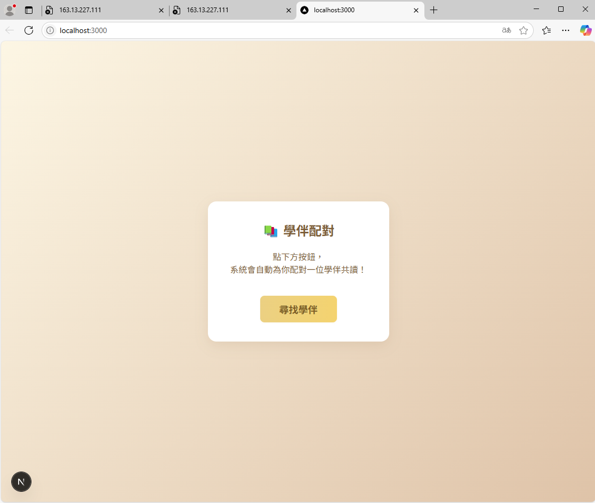
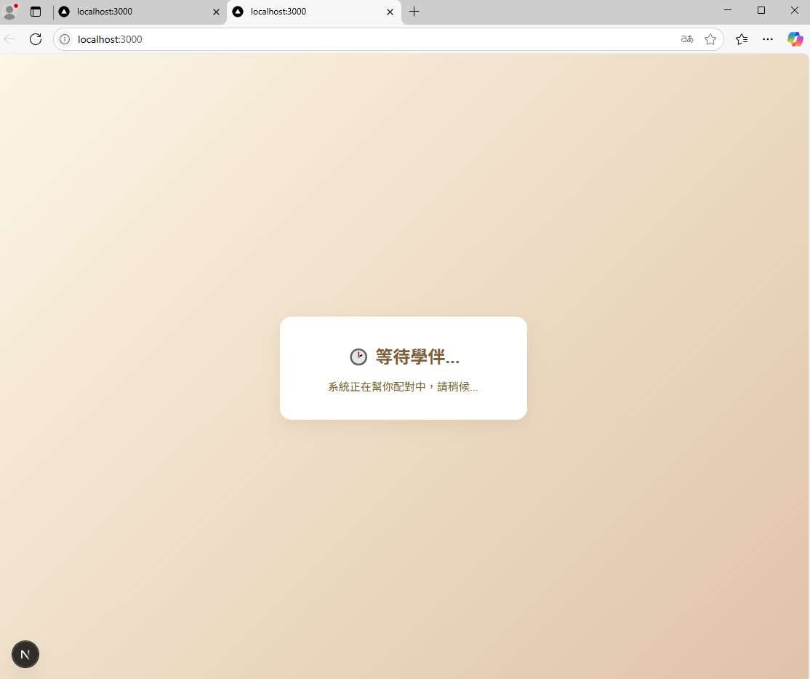
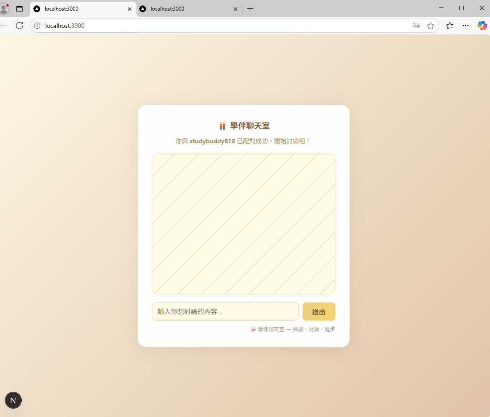
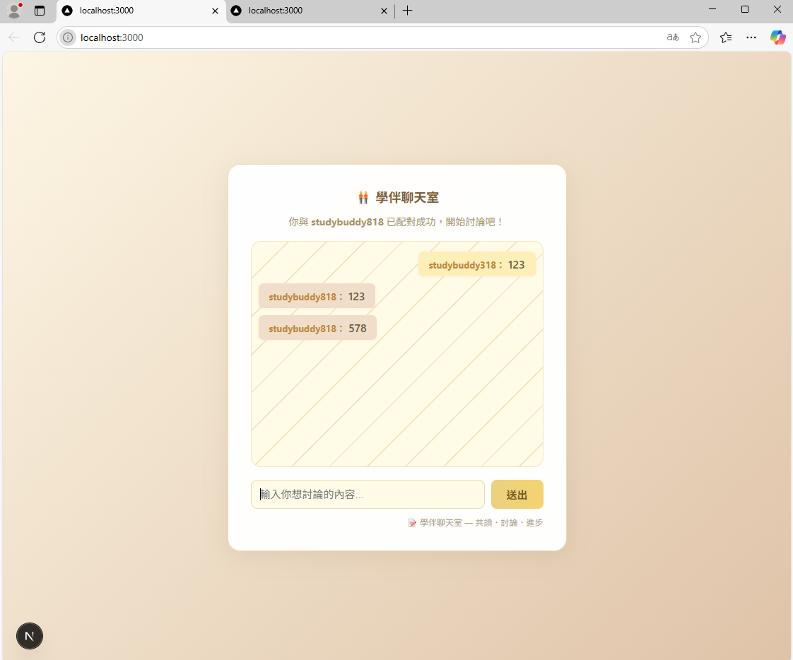

# StudyBuddy Chatroom
這是一個簡單的匿名聊天功能 目前已經搭建起來配對系統 但是全部採用簡單隨機配對的方式


## 🔥 功能瀏覽

### 1. 學伴自動配對入口


### 2. 配對等待畫面


### 3. 配對成功後進入 1 對 1 聊天


### 4. 聊天室主要畫面


---

## 主要功能
- 學伴隨機配對
- 1 對 1 即時聊天
- 訊息自動保存（MongoDB）
- 前端：Next.js
- 後端：Node.js + Socket.io + Express

## 啟動方式

1. 啟動 MongoDB
2. 啟動後端
    ```
    node server.js
    ```
3. 啟動前端
    ```
    cd client
    npm run dev
    ```
4. 瀏覽器打開 [http://localhost:3000](http://localhost:3000)

---

> 如果要一鍵啟動，根目錄可以執行 `npm run dev`（需安裝 concurrently）

---
